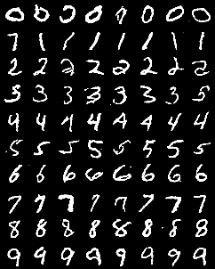

# tiny-diffusion
A simple Pytorch implementation of probabilistic diffusion models. The starting point is [tiny-diffusion](https://github.com/tanelp/tiny-diffusion) for 2D datasets. Then, it is adapted to run for MNIST and CIFAR-10.

Get started by running `python train.py -h` to explore the available options for training.

For MNIST and CIFAR-10, run `python gen.py -h` to see the avaiable options for visualization.

Note: To run the saved models, please go to the corresponding commit.

To check the performance of the lastest model, run
`python .\gen.py --dataset="mnist" --model_path="saved_model/mnist_model@149epo.pth" --table=True`
or
`python .\gen.py --dataset="cifar10" --model_path="saved_model/cifar10_model@149epo.pth" --table=True`
and check out the generation table in `/exps/base/reverse-process`. The result for MNIST is also illustrated above.

## References

* The dino dataset comes from the [Datasaurus Dozen](https://www.autodesk.com/research/publications/same-stats-different-graphs) data.
* [tiny-diffusion](https://github.com/tanelp/tiny-diffusion).
* Jonathan Ho's [implementation of DDPM](https://github.com/hojonathanho/diffusion).
* John Calzeretta's [implementation of DDPM for MNIST](https://github.com/jcalz23/diffusion_diy).

